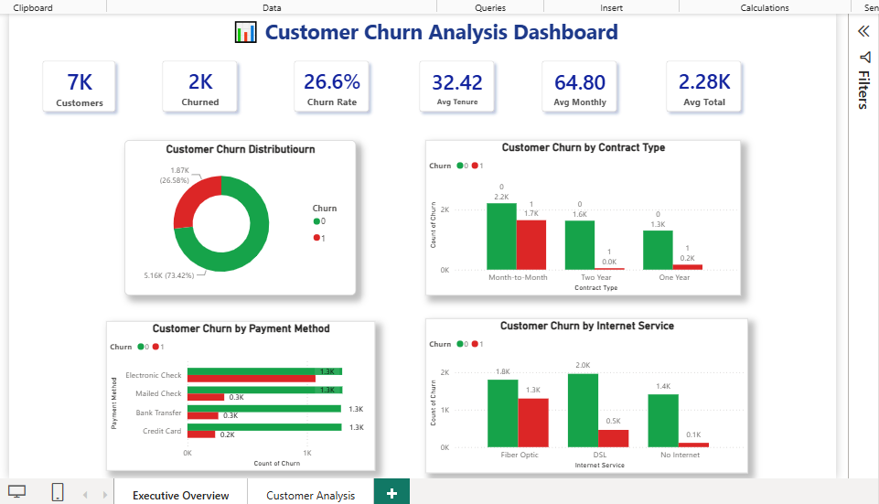
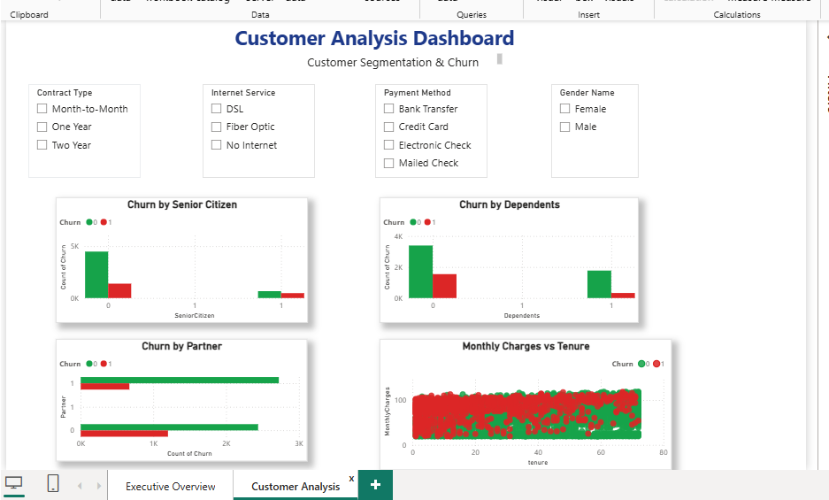

# 📊 Customer Churn Analysis & Prediction

## 📌 Project Overview

This project presents an **end-to-end Customer Churn Analysis and Prediction** solution using **Python, SQL, Machine Learning, and Power BI**. The objective is to identify the key factors influencing customer churn, build predictive machine learning models, and provide actionable business insights through an interactive dashboard.

The project follows a complete data analytics workflow including **data preprocessing, exploratory data analysis (EDA), feature engineering, predictive model development, evaluation, and business intelligence visualization**.

---

## 🎯 Business Objective

- Analyze customer behavior and churn patterns.
- Identify the major factors contributing to customer churn.
- Build predictive models to classify customers likely to churn.
- Enable data-driven customer retention strategies.

---

## 📂 Dataset

- **Dataset:** Telco Customer Churn Dataset
- **Records:** 7,032 Customers
- **Original Features:** 21
- **Engineered Features:** 30+

---

## 🛠️ Tech Stack

- Python
- Pandas
- NumPy
- Matplotlib
- Scikit-learn
- SQL
- Jupyter Notebook
- Power BI
- Git
- GitHub

---

## 📈 Exploratory Data Analysis (EDA)

Performed comprehensive exploratory data analysis to understand customer churn behavior.

### Key analyses include:

- Customer Demographics
- Tenure Analysis
- Contract Type Analysis
- Payment Method Analysis
- Internet Service Analysis
- Monthly Charges
- Total Charges
- Paperless Billing
- Online Security
- Online Backup
- Device Protection
- Tech Support
- Streaming Services

---

## ⚙️ Data Preprocessing

- Missing Value Treatment
- Data Cleaning
- Duplicate Validation
- Feature Encoding
- Label Encoding
- One-Hot Encoding
- Feature Engineering
- Train-Test Split

---

## 🤖 Machine Learning Models

The following classification models were developed and evaluated:

- Logistic Regression
- Decision Tree Classifier
- Random Forest Classifier

---

## 📊 Model Performance

| Model               | Accuracy   |
| ------------------- | ---------- |
| Logistic Regression | **80.31%** |
| Random Forest       | **78.54%** |
| Decision Tree       | **71.29%** |

🏆 **Best Performing Model:** Logistic Regression

---

## 📌 Key Business Insights

- Customers with **Month-to-Month contracts** exhibit the highest churn rate.
- **Fiber Optic** users churn significantly more than DSL users.
- **Electronic Check** customers show the highest churn percentage.
- Customers without **Online Security** and **Tech Support** are more likely to churn.
- **Paperless Billing** customers churn more frequently.
- Customers with **Longer Tenure** demonstrate stronger retention.
- Customers with **Higher Monthly Charges** exhibit greater churn probability.

---

# 📊 Power BI Dashboard

The interactive Power BI dashboard provides business insights through two report pages.

### 📍 Executive Overview

- KPI Cards
- Customer Churn Distribution
- Churn by Contract Type
- Churn by Payment Method
- Churn by Internet Service

### 📍 Customer Analysis

- Interactive Filters
- Churn by Senior Citizen
- Churn by Dependents
- Churn by Partner
- Monthly Charges vs Tenure Scatter Plot

### 🎛️ Available Filters

- Contract Type
- Internet Service
- Payment Method
- Gender

---

# 📷 Dashboard Preview

## Executive Overview



## Customer Analysis Dashboard



---

## 📁 Project Structure

```text
Customer-Churn-Analysis/
│
├── dashboard/
│   └── Customer_Churn_Dashboard.pbix
│
├── data/
│
├── images/
│   ├── dashboard_page1.png
│   └── dashboard_page2.png
│
├── models/
│   └── customer_churn_model.pkl
│
├── notebooks/
│   └── customer_churn_analysis.ipynb
│
├── sql/
│
├── .gitignore
├── main.py
├── README.md
└── requirements.txt
```

---

## 🚀 Future Enhancements

- Deploy the Machine Learning model using Streamlit
- Publish dashboard to Power BI Service
- Real-time customer churn prediction
- Add advanced DAX measures and KPIs
- Hyperparameter tuning for improved model performance
- Build REST API using Flask/FastAPI

---

## 👩‍💻 Author

**Shaima Sheikh**

🎓 BCA Student | Aspiring Data Analyst

🔗 GitHub: https://github.com/WebHubio
